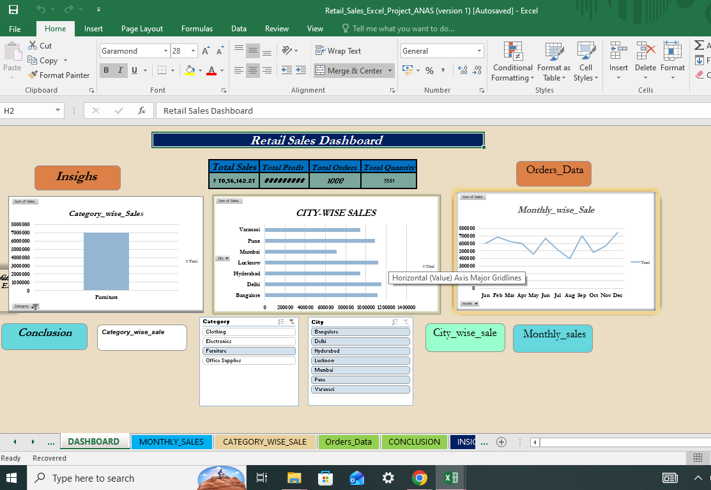
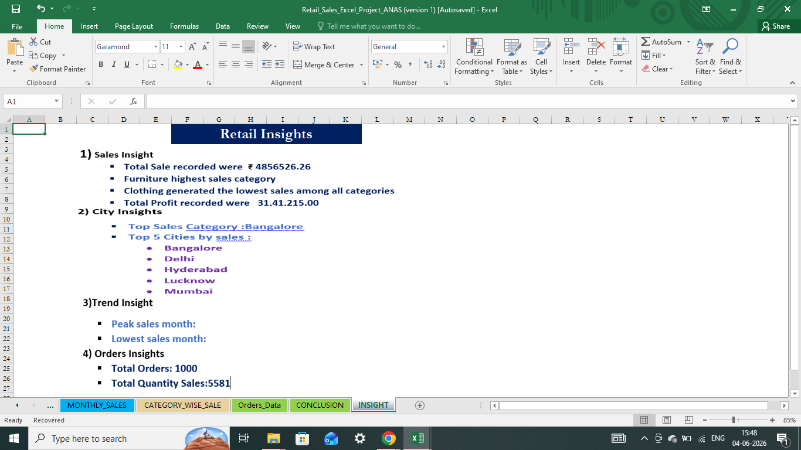

Retail Sales Dashboard in Excel
Project Overview
This project analyzes retail sales data using Microsoft Excel and presents insights through an interactive dashboard.
## Tools Used
• Microsoft Excel
• Pivot Tables
• Pivot Charts
• KPI Cards
• Slicers
## Key Insights
• Furniture generated the highest sales.
• Clothing generated the lowest sales.
• Bangalore was the top-performing city.
• Varanasi recorded the lowest sales.
• July was the highest sales month.
## Skills Demonstrated
• Data Cleaning
• Data Validation
• Data Visualization
• Dashboard Creation
• Business Insights
## Dashboard Preview

## insight Preview

